# Stackoverflow App

## Đề tài

**Stackoverflow - Ứng dụng di động hỏi đáp**

Ứng dụng mobile lấy cảm hứng từ nền tảng hỏi đáp lập trình Stack Overflow. Người dùng có thể đăng ký, đăng nhập, đặt câu hỏi, xem danh sách câu hỏi, trả lời, bình luận, vote, xem thông báo, quản lý hồ sơ cá nhân và sử dụng các chức năng quản trị.

## Thành viên nhóm

### Sinh viên 1
- **Họ và tên:** Tô Minh Hiếu
- **Mã sinh viên:** 23810310284
- **Phân công:** Home, Question Detail, Profile, Edit Profile, Admin

### Sinh viên 2
- **Họ và tên:** Nguyễn Nhật Mai
- **Mã sinh viên:** 23810310266
- **Phân công:** Ask Question, Tag, User, Login

### Sinh viên 3
- **Họ và tên:** Chu Thị Vân Anh
- **Mã sinh viên:** 23810310295
- **Phân công:** Notification, Question, Register

## Chức năng chính

- Đăng ký, đăng nhập tài khoản
- Xem danh sách câu hỏi
- Đặt câu hỏi mới
- Xem chi tiết câu hỏi
- Bình luận và trả lời câu hỏi
- Vote cho câu hỏi hoặc câu trả lời
- Xem danh sách tag
- Xem danh sách user
- Xem và chỉnh sửa thông tin cá nhân
- Nhận thông báo
- Màn hình quản trị dành cho Admin
- Quản lý người dùng, quản lý câu hỏi và duyệt câu hỏi

## Công nghệ sử dụng

- **React Native**: Xây dựng giao diện ứng dụng mobile
- **Expo**: Công cụ phát triển và chạy React Native app
- **React**: Xây dựng component UI
- **React Navigation**: Điều hướng màn hình trong ứng dụng
- **Async Storage**: Lưu trữ dữ liệu cục bộ như token hoặc thông tin đăng nhập
- **Expo Image Picker**: Chọn ảnh từ thiết bị
- **JavaScript**: Ngôn ngữ lập trình chính
- **Android native project**: Project có thư mục `android/` để build và chạy native Android
- **EAS Build**: Cấu hình build app qua `eas.json`

## Thư viện cần cài đặt

Các thư viện chính được khai báo trong `package.json`:

```json
{
  "@react-native-async-storage/async-storage": "2.2.0",
  "@react-navigation/bottom-tabs": "^7.15.10",
  "@react-navigation/drawer": "^7.9.9",
  "@react-navigation/native": "^7.2.2",
  "@react-navigation/native-stack": "^7.14.12",
  "expo": "~54.0.33",
  "expo-image-picker": "^55.0.19",
  "expo-status-bar": "~3.0.9",
  "react": "19.1.0",
  "react-native": "0.81.5",
  "react-native-gesture-handler": "~2.28.0",
  "react-native-safe-area-context": "~5.6.0",
  "react-native-screens": "~4.16.0"
}
```

Thông thường chỉ cần chạy `npm install`, npm sẽ tự động cài đặt toàn bộ thư viện theo `package.json` và `package-lock.json`.

## Yêu cầu môi trường

Trước khi chạy project, cần cài đặt:

- **Node.js** phiên bản LTS
- **npm** đi kèm Node.js
- **Expo CLI** hoặc dùng trực tiếp qua `npx expo`
- **Expo Go** trên điện thoại nếu muốn chạy bằng QR code
- **Android Studio** nếu muốn chạy trên Android Emulator hoặc build native Android
- **Git** nếu clone project từ repository

Kiểm tra phiên bản Node.js và npm:

```bash
node -v
npm -v
```

## Hướng dẫn cài đặt

### Bước 1: Clone hoặc mở project

Nếu clone từ repository:

```bash
git clone <repository-url>
cd Stackoverflow-app
```

Nếu đã có source code, mở terminal tại thư mục:

```bash
cd Stackoverflow-app
```

### Bước 2: Cài đặt dependencies

```bash
npm install
```

### Bước 3: Kiểm tra cấu hình API backend

File cấu hình API nằm tại:

```text
src/shared/utils/api.js
```

Ứng dụng đang gọi backend qua port `5036` trong môi trường local/dev:

```text
http://<ip-may-tinh>:5036
http://localhost:5036
```

Vì vậy cần đảm bảo backend Stackoverflow API đã được chạy trước khi sử dụng các chức năng đăng nhập, đăng ký, câu hỏi, bình luận, vote, thông báo, admin.

Nếu chạy trên thiết bị thật, điện thoại và máy tính cần dùng chung mạng Wi-Fi để app có thể kết nối tới backend local.

## Hướng dẫn chạy project

### Chạy Expo development server

```bash
npm start
```

Hoặc:

```bash
npx expo start
```

Sau khi chạy lệnh, Expo sẽ hiển thị QR code. Có thể:

- Quét QR bằng app **Expo Go** trên điện thoại
- Nhấn `a` trong terminal để mở Android Emulator
- Nhấn `w` để chạy bản web nếu môi trường hỗ trợ

### Chạy trên Android

```bash
npm run android
```

Lệnh này tương đương:

```bash
expo run:android
```

Cần cài Android Studio và cấu hình Android Emulator hoặc kết nối thiết bị Android thật.

### Chạy trên iOS

```bash
npm run ios
```

Lưu ý: Chạy iOS cần môi trường macOS có Xcode.

### Chạy trên web

```bash
npm run web
```

## Tài khoản demo(phải chạy phía be trước để có dữ liệu)
Email: admin@gmail.com 
Password: admin123

## Scripts trong project

```bash
npm start       # Chạy Expo development server
npm run android # Build và chạy app trên Android
npm run ios     # Build và chạy app trên iOS
npm run web     # Chạy app trên web
```

## Cấu trúc project

```text
Stackoverflow-app/
├── App.js
├── app.json
├── index.js
├── package.json
├── eas.json
├── android/
├── assets/
└── src/
    ├── features/
    │   ├── admin/
    │   ├── auth/
    │   ├── home/
    │   ├── notification/
    │   ├── profile/
    │   ├── questions/
    │   ├── splash/
    │   ├── tags/
    │   └── users/
    └── shared/
        ├── components/
        ├── navigation/
        └── utils/
```

## Mô tả thư mục chính

- `src/features/admin`: Chức năng quản trị, quản lý user, quản lý câu hỏi, duyệt câu hỏi
- `src/features/auth`: Đăng nhập, đăng ký, context xác thực và service auth
- `src/features/home`: Màn hình trang chủ
- `src/features/notification`: Màn hình và service thông báo
- `src/features/profile`: Xem và chỉnh sửa hồ sơ cá nhân
- `src/features/questions`: Danh sách câu hỏi, đặt câu hỏi, chi tiết câu hỏi, comment, vote
- `src/features/tags`: Danh sách tag
- `src/features/users`: Danh sách user
- `src/features/splash`: Màn hình splash/loading
- `src/shared/components`: Component dùng chung như TopBar, BottomBar, DrawerMenu, Pagination
- `src/shared/navigation`: Cấu hình điều hướng app
- `src/shared/utils`: Tiện ích dùng chung, bao gồm cấu hình API

## Lưu ý khi chạy

- Backend cần chạy trước để app gọi API thành công.
- Nếu app không kết nối được backend trên thiết bị thật, kiểm tra lại IP máy tính, Wi-Fi và cấu hình trong `src/shared/utils/api.js`.
- Nếu gặp lỗi dependency, xóa `node_modules` và chạy lại `npm install`.
- Nếu chạy Android lỗi build, kiểm tra Android Studio, SDK, emulator và biến môi trường Android.

## Giao diện app mobile
- Trang Login
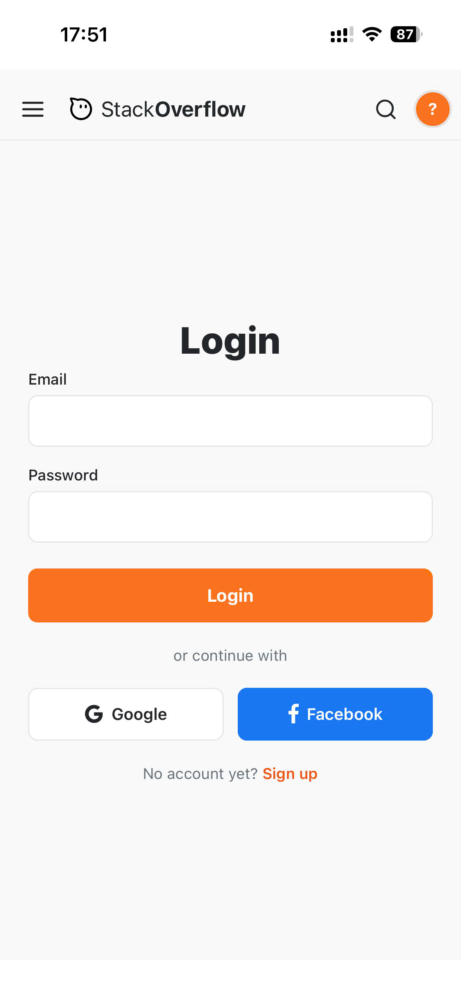
- Trang Register
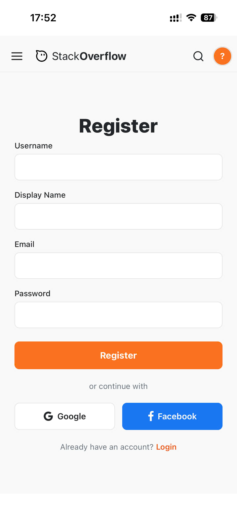
- Trang Home
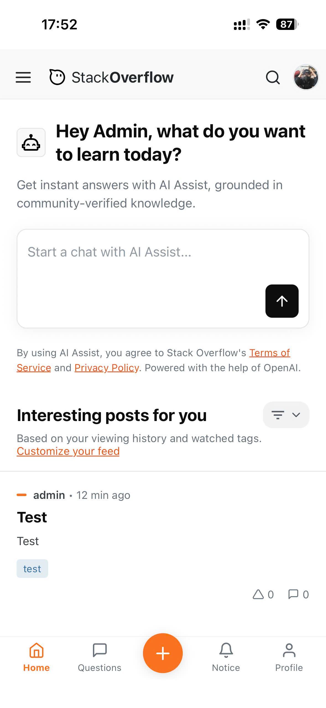
- Trang Question
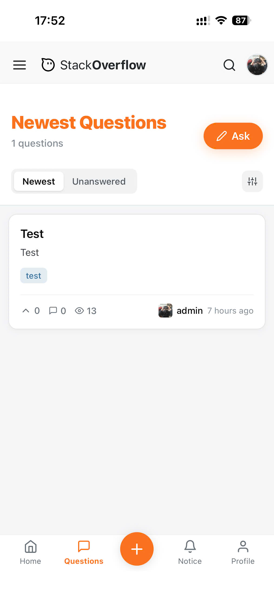
- Trang Ask Question
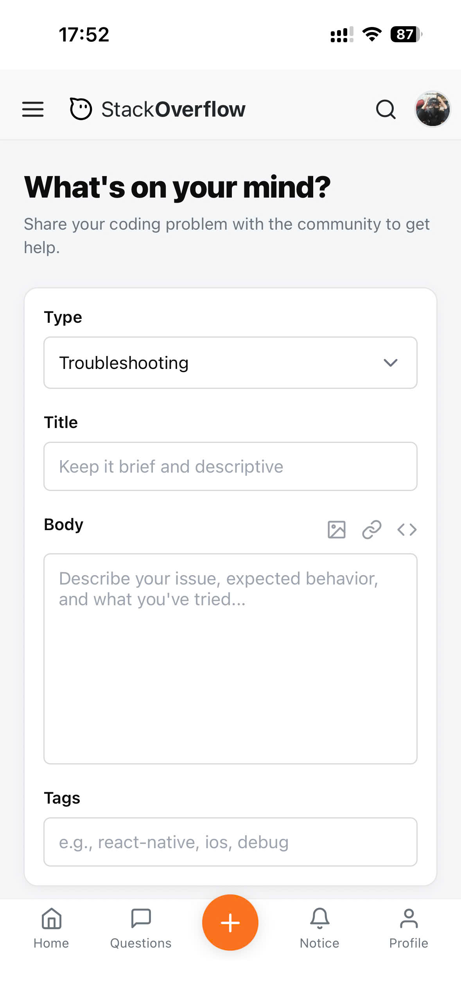
- Trang Question Detail
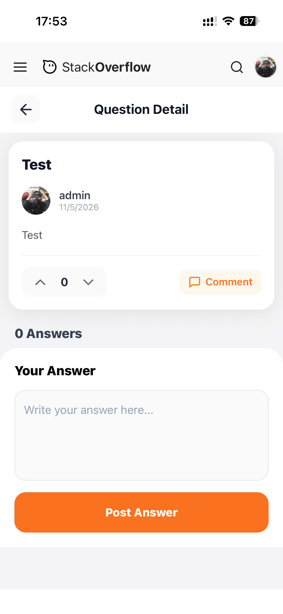
- Trang Profile
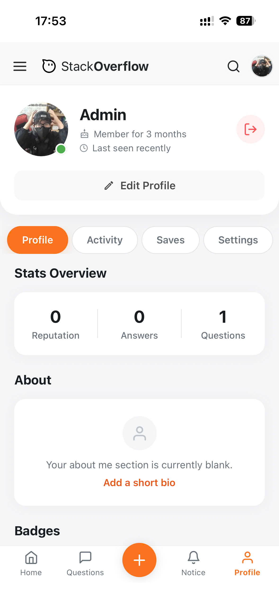
- Trang Edit Profile
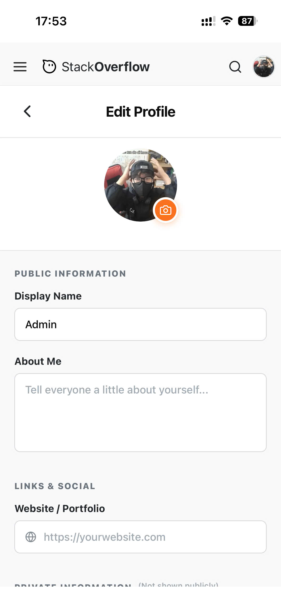
- Trang Tag
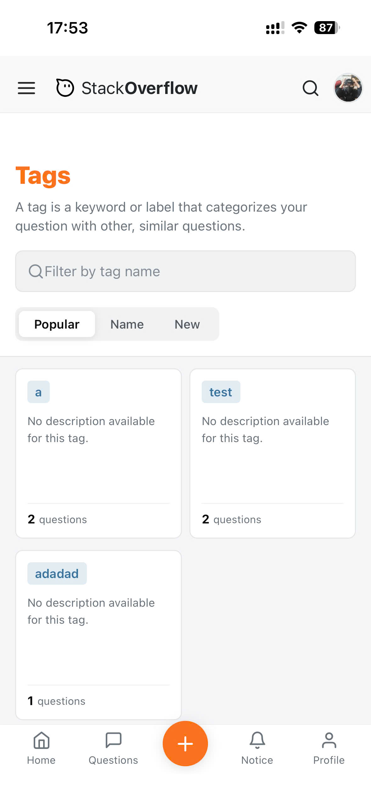
- Trang User
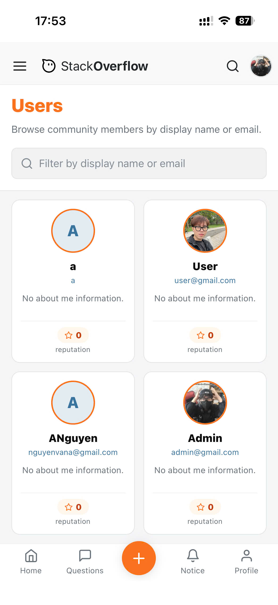
- Trang Admin
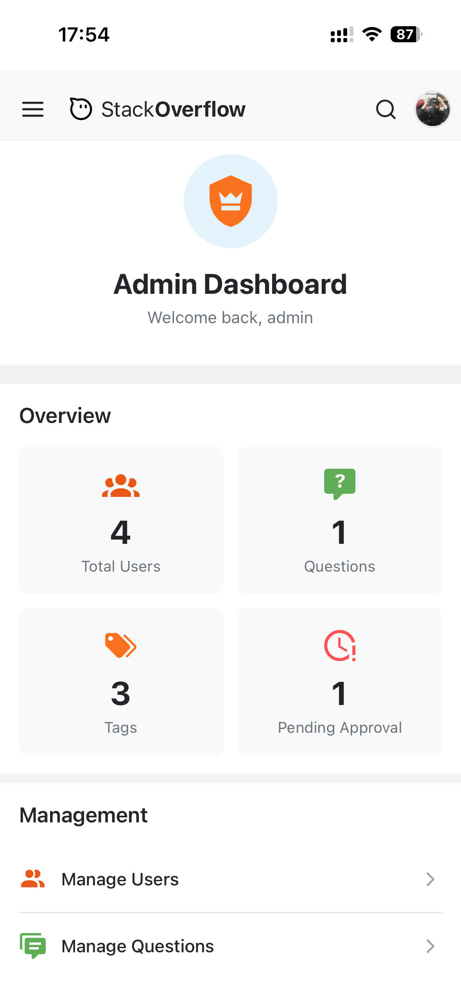
- Trang Notification
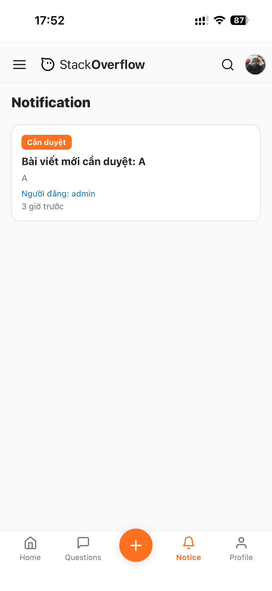

## Link deploy
https://expo.dev/accounts/minhhieu86/projects/Stackoverflow-app/builds/558961f2-2329-4547-8757-5353bc957d2e